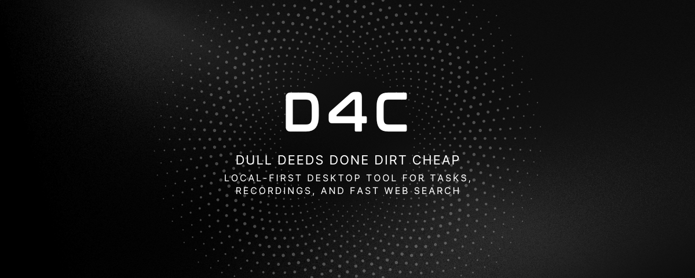
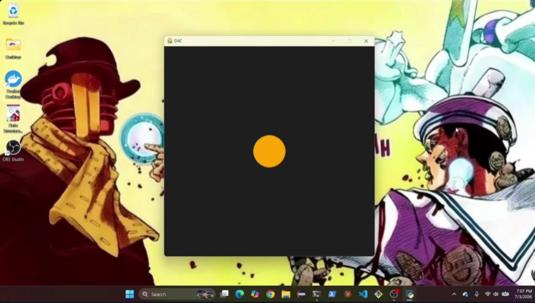
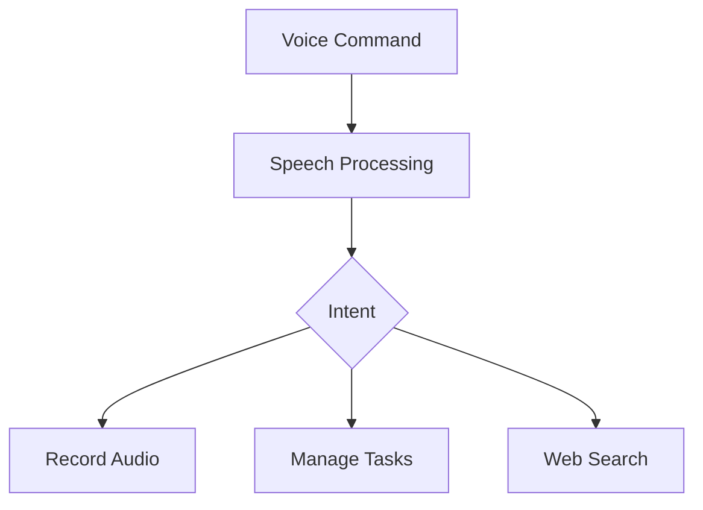

<p align="center">
  
</p>

<p align="center">
  
  
  
  
  
  
</p>

<p align="center">
  <b>Local-first desktop assistant for voice recordings, task management, and fast web search.</b>
</p>

<p align="center">
  <a href="#value-proposition">Value Proposition</a> •
  <a href="#demo">Demo</a> •
  <a href="#features">Features</a> •
  <a href="#how-it-works">How It Works</a> •
  <a href="#interface--experience">Interface</a> •
  <a href="#quick-start">Quick Start</a> •
  <a href="#starter-commands">Starter Commands</a> •
  <a href="#roadmap">Roadmap</a>
  
</p>

---

## Value Proposition

D4C simplifies everyday desktop tasks through voice interaction.

Instead of switching between applications to manage notes, open a browser, or keep track of tasks, D4C provides a lightweight local assistant that helps you record audio, manage simple tasks, and perform fast web searches from one place.

Everything runs locally, keeping the experience fast, private, and easy to use.

---

## Demo



<a href="https://drive.google.com/file/d/1RsXpwErJO2-ExKG7jkYHsaLv4Q1PWzYN/view?usp=drive_link">Watch Demo</a>

---

## Features

### Audio Recording

- Record voice memos and lectures directly from the desktop.
- Store recordings locally for easy access and management.

### Task Management

- Create and manage simple tasks.
- View and maintain your tasks from one place.
- In order to remove tasks, tell D4C to delete the task you had on that date

### Fast Web Search

- Quickly search the web using your default browser.
- Uses Python's `webbrowser` library for a simple, cross-platform experience.

### Local-First Experience

- Runs entirely on your machine.
- Lightweight and designed for minimal setup.
- No accounts, subscriptions, or cloud services required.

---

## How It Works



D4C listens for a command, determines the user's intent, and routes the request to one of its core features: recording audio, managing tasks, or opening a web search.

## Interface & Experience

D4C is designed to stay out of the way until you need it.

- **Record:** Capture voice notes and save them locally.
- **Manage:** Quickly add and view tasks.
- **Search:** Open web searches instantly in your default browser.

The goal is to provide useful desktop utilities with as little friction as possible.

---

## Installation

### Prerequisites

- Python 3.10+
- pip
- Git (optional)

---

## Windows Setup

### 1. Clone the repository

```bash
git clone https://github.com/mswarnendu/dull-deeds-done-dirt-cheap.git
cd dull-deeds-done-dirt-cheap
```

### 2. Create virtual environment

```bash
python -m venv venv
```

### 3. Activate Virtual Environment

```bash
venv\Scripts\activate
```

### 4. Install Dependencies

```bash
pip install -r requirements.txt
```

### 5. Run D4C

Windows:
`python main.py`

Mac/Linux:
`python3 main.py`

Optional no-terminal mode (Windows):
`pythonw.exe main.py`

---

## Starter Commands

### Wake Word

- Wake up

Format:
`Wake up`

---

### Web Search

- Search Python decorators
- Search AP Physics formulas
- Search weather in Phoenix

Format:
`Search [query]`

---

### Recording

- Start a 50 minute recording for a chemistry lecture
- Start recording for 20 seconds for my math class
- Open recordings folder

Format:

- `Start recording for [duration] for [context]`
- `Open recordings folder`

---

### Task Management

- Add a task to finish AP CSA project tomorrow
- Add a task to study for AP Physics test tomorrow
- Show my tasks
- Delete my task for tomorrow

Format:

- `Add task: [task description + optional deadline]`
- `Show my tasks`
- `Delete the task I had on [deadline]`

---

### Termination Code

Go to sleep

Format:
`Go to sleep`

---

## Final Note

D4C is a lightweight, local-first desktop assistant built for everyday productivity.
